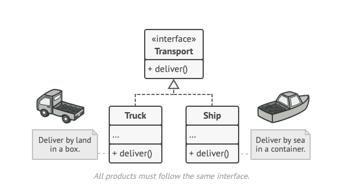

                                ## **Factory Design Pattern** ##

Factory Method is a creational design pattern that provides an interface for creating objects in a superclass, but allows subclasses to alter the type of objects that will be created.

Resource : https://refactoring.guru/design-patterns/factory-method

                           
