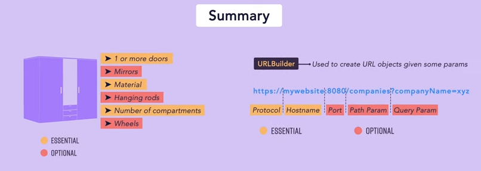

Builder is a creational design pattern that lets you construct complex objects 
step by step. The pattern allows you to produce different types and representations 
of an object using the same construction code.

* Creating Complex Object 
* When we have Complex Constructor in any class for which object is needed then builder pattern is for 
* Hels with Immutable Objects : Define Objects which once create will never changed
* Less of Expose Setters

Resource : https://www.youtube.com/watch?v=4ff_KZdvJn8

Example : 

