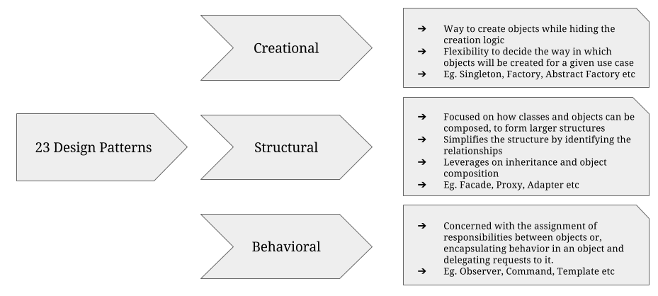
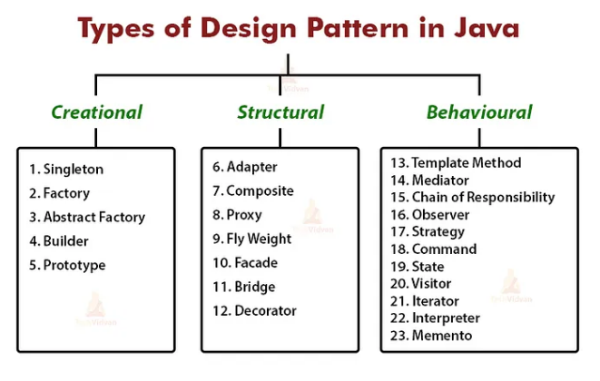

What are Design Patterns?
Design patterns are basically defined as reusable solutions to the common problems that 
arise during software design and development. They are general templates or best practices 
that guide developers in creating well-structured, maintainable, and efficient code.

Sources: 

https://www.geeksforgeeks.org/complete-guide-to-design-patterns-in-programming/
https://medium.com/geekculture/3-design-patterns-i-applied-in-my-java-code-in-one-hour-59bf6fe46673
https://www.dineshonjava.com/design-patterns_25/
https://webfuse.in/blogs/design-patterns-the-secret-to-writing-better-code/

